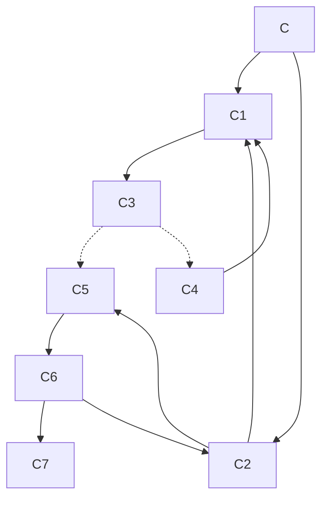

# Coinduction

This sub-chapter is meant to describe the current handling of coinductive goals in the recursive solver rather than providing an extensive overview over the theoretical backgrounds and ideas.
It follows the description in [this GitHub comment](https://github.com/rust-lang/chalk/issues/399#issuecomment-643420016) and the Zulip topic linked there.

## General Idea
The general idea for the handling of coinductive cycles in the recursive solver is to start by assuming the goal is provable and then try to find evidence that it is not.
This search for a disproof is done by the standard recursive solving process described in the sub-chapters before.

Albeit this approach would allow for the handling of mixed inductive/co-inductive cycles, these are actually handled as errors to prevent propagation of the assumed provability outside of the coinductive cycle.
This propagation of the assumed solution might also happen in pure coinductive cycles and can potentially lead to false positives.

## Prevention of False Positives
The problem of false positives propagated outside of the coinductive cycle is also described in the [Coinduction chapter](../engine/logic/coinduction.md) for the SLG solver alongside the rather complex handling used with it.

### The Problem
The problem arises if a solution that is purely based on the positive starting value for the coinductive cycle is cached and as such propagated to other goals that are possibly reliant on this. An example may look like this (cf. the test case `coinduction::coinductive_unsound1`):

```notrust
C :- C1.
C :- C2.
C1 :- C2, C3.
C2 :- C1.
```

Here `C` may be proved by either showing `C1` or `C2`.
Assuming the solver starts evaluating the branch with `C1` first, it then recursively tries to prove `C2` and `C3`.
For proving `C2` it needs to show `C1` again, the coinductive cycle becomes evident.
Therefore, `C1` is assumed to be provable and the solver proves `C2` with this information.
Assuming, the solve does not handle this case specifically, the solution for `C2` is cached. 
Now it tries solving `C3` but fails due to the lack of information about it.
As such, `C1` can also not be proven for this program.
The recursive solver will now attempt to prove the initial goal `C` by solving `C2`.
Unfortunately, it finds the invalidly cached solution and returns it as proof for `C`.

By visualizing this path of computation, the problem becomes evident:
* Start proving `C` with `C1`:
    * For `C1` prove `C2` and `C3`:
        * For `C2` prove `C1`:
            * This is a coinductive cycle. Assume that `C1` holds.
        * Thus `C2` also holds. Store this result about `C2` in the cache.
        * There is no way to prove `C3`. Lift this failure up.
    * Due to the failure of `C3` there is also no solution for `C1`.
* Try proving `C` with `C2`:
    * Find the cached result that `C2` has a solution and return it as the solution for `C`.
* Stop with the invalid result for `C`.

### The Solution
The above example should make it evident that the caching of found solutions in coinductive cycles can lead to false positives and should therefore be prevented.
One approach to achieve this is to use a second dedicated cache for results that depend on the initial assumption of a coinductive cycle.
This cache can then either be deleted if the assumption did not hold or moved to the standard cache if it did hold.

The tricky part about this two-leveled cache is tracking which results are generally valid and can thus be cached (these is called "mature" results in the following) and which results depend on an assumption ("premature" results).
For each coinductive cycle, the first result that is determined to be premature is the assumption itself, i.e. the result for the cycle start (`C1` in the above example).
Results for other goals are labeled premature if at least one subgoal has a premature result (e.g. `C2` depends on `C1`, thus `C2` is also premature).
Finished goals that have a premature result are then stored in the temporary cache.
For the caches the following invariant holds: results stored in the temporary cache are by definition premature whereas all results in the standard cache are mature.

For each premature result, all coinductive assumptions that result depends upon are collected and stored alongside the result in the temporary cache.
With this information, it is possible to track the concrete dependencies of each result even if nested coinductive cycles occur.
If such a nested cycle is finished, all results that depend on it can either be dropped if the assumption for this cycle was disproved or they become mature and can be moved to the standard cache.

A special case occurs if a cycle start depends on the coinductive assumption of an enclosing active cycle.
In this case, the result for the cycle start is still premature after finishing the cycle and needs to be kept in the temporary cache.
The following is an example where this happens. `C5` depends indirectly on the cycle start `C1` but is itself also a cycle start. 
Thus, these two cycles are nested and interconnected, as the cycle starting with `C1` can't be finished without the cycle starting with `C5` be finished first, which in turn depends on the first one again.

```notrust
C :- C1, C2.
C1 :- C3. 
C3 :- C4.
C3 :- C5.
C4 :- C1. // First cycle
C5 :- C6.
C6 :- C2, C7.
C2 :- C5, C1. // Second cycle and dependency to first cycle
```


