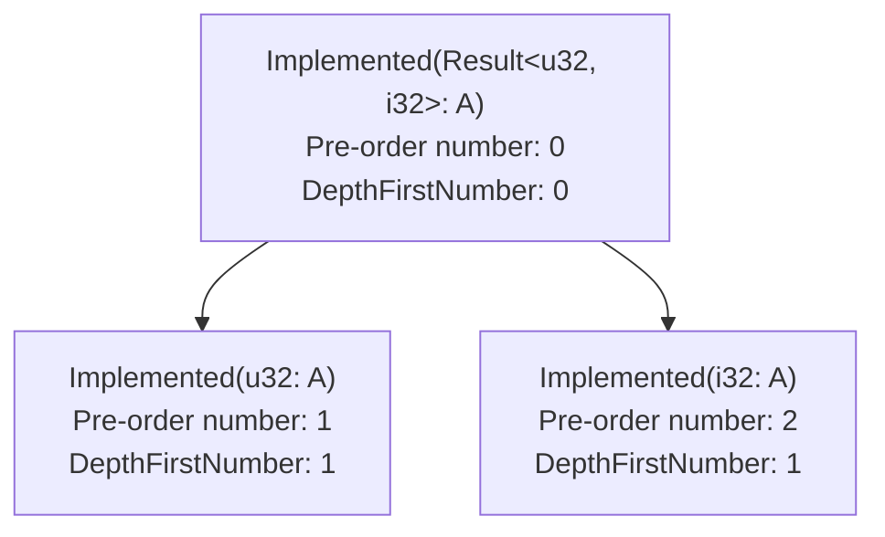
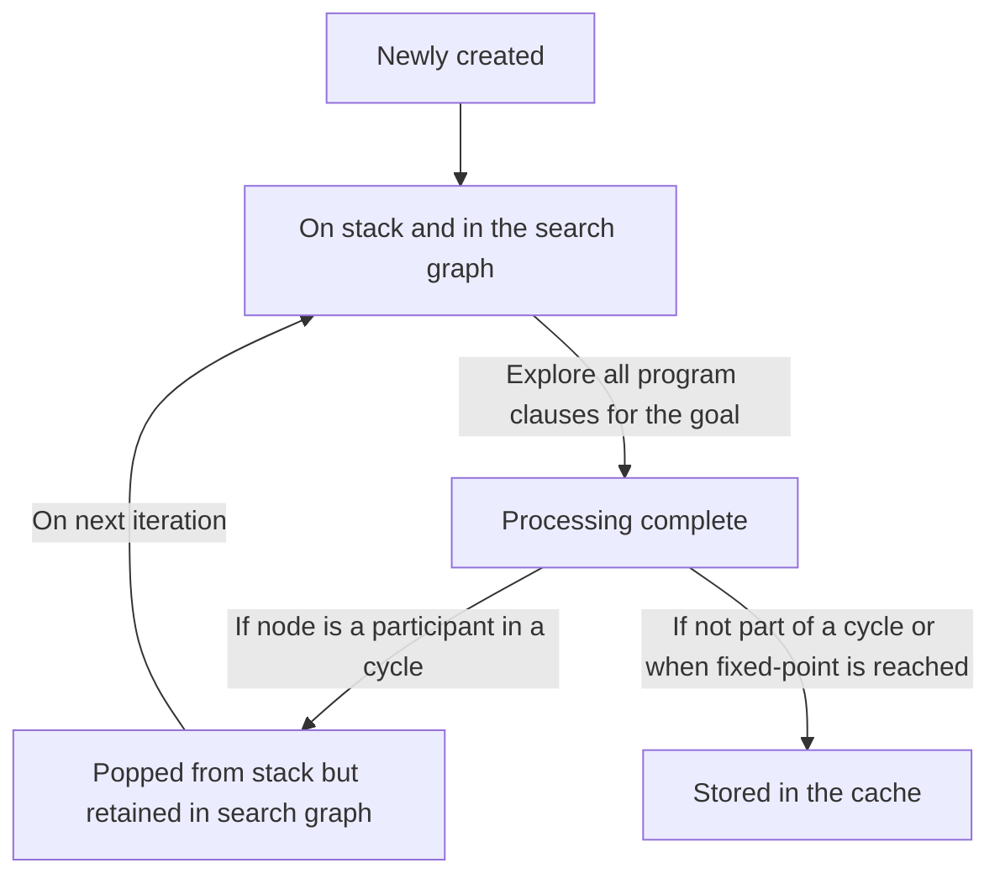
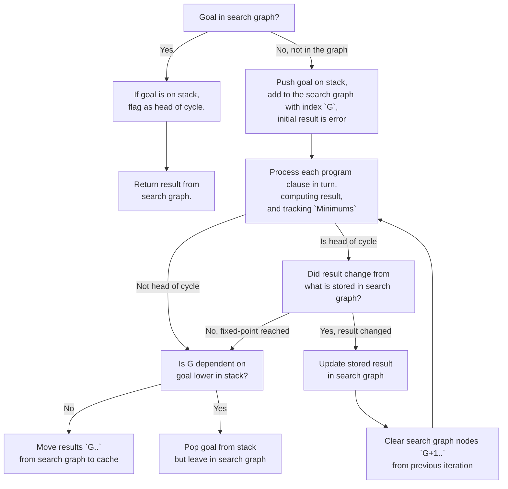

# The search graph and caching

So now we have a good idea of [what behavior we expect from cycles][cycles], or
at least inductive cycles (we'll talk about [coinduction] later). But how do we
actually implement this? That's where the [`SearchGraph`] comes into play.

[cycles]: ./inductive_cycles.md
[coinduction]: ./coinduction.md
[stack]: ./stack.md
[`SearchGraph`]: https://rust-lang.github.io/chalk/chalk_recursive/fixed_point/search_graph/struct.SearchGraph.html
[`DepthFirstNumber`]: https://rust-lang.github.io/chalk/chalk_recursive/fixed_point/search_graph/struct.DepthFirstNumber.html
[`Node`]: https://rust-lang.github.io/chalk/chalk_recursive/fixed_point/search_graph/struct.Node.html
[`stack_depth`]: https://rust-lang.github.io/chalk/chalk_recursive/fixed_point/search_graph/struct.Node.html#structfield.stack_depth

The role of the [`SearchGraph`] is to store information about each goal that we
are currently solving. Typically, these are goals on the stack -- but other
times, they are goals that are no longer on the stack, but whose results
(because of a cycle) were dependent on something that is still on the stack.
We'll work through some examples to make it all clear.


## Structure of the search graph

The search graph consists of nodes, each of which is assigned an index called a
[`DepthFirstNumber`]. The name of this index alludes to the fact that, as we try
to prove a given goal, we are implicitly performing a "depth-first search" over
a graph of subgoals, and the index in the search graph is similar to a pre-order
index on the resulting tree.

### Example search graph

Consider this example trait plus impls:

```rust
trait A { }
impl<T: A, U: A> A for Result<T, U> { }
impl A for u32 { }
impl A for i32 { }
impl A for f32 { }
```

If we consider the full set of goals/subgoals that are involved in proving `Implemented(Result<u32, i32>: A)`, 
it would look like this:



The graph also shows a possible set of pre-order numbers, as well as the
[`DepthFirstNumber`] that would be used in the search graph. You can see that
they start to diverge. Pre-order numbers uniquely identify each goal in the
graph. In contrast, after we finish proving `Implemented(u32: A)`, we remove
that node the graph, and hence its [`DepthFirstNumber`] is re-used.

## Goal lifecycle

Every goal that we prove in the recursive solver goes through the following states:



At first, we create the goal and push it onto the stack, and we also add it to
the search graph. We then explore each of the relevant program clauses to try and
find the solution(s) to the goal. Along the way we update the overall solution:

* If there are no valid solutions, then the result is an error.
* If there is exactly one solution, then we remember it as the unique solution.
* If there are multiple distinct solutions, the result is "ambiguous".

While we are doing this solving, we also track what other goals this goal winds
up depending on. In particular, we are looking to see whether it winds up as a
participant in a cycle -- that is, if it depends on any goals further up the
goal stack.

If, when we're done with all program clauses, the goal never participated in any
cycles, then we have reached our final solution. We can take that result and put
it into the cache. The next time we look for a solution to this goal, we'll
check that cache and return the result.

But otherwise, if the goal *was* a participant in a cycle, then we have to
iterate, as described in the [section on cycles](./inductive_cycles.md). In that
case, we keep the goal in the search graph, but we remove it from the stack.
This allows the search graph to serve as a kind of "interim cache". If, as we
continue to search through the other nodes that remain on the stack, we have to
solve this same goal again, we will find it in the search cache and re-use the
result.

For goals that are participants in a cycle, when the cycle reaches its
fixed-point (i.e., the top-most node has stopped changing), we go through and
take all the results for all the subgoals (which are still present in the search
graph) and move them all into the "final cache".

In other words, any result that is present in the *search graph* can be
considered an "interim cache", with a result that is still being determined and
may be dependent on other goals on the stack. Once the goal is completely
processed, it is moved to the cache field where others can use it.

## Processing a single goal, a flow chart

Whenever we are asked to solve a goal, these are the steps we take:



## Starting to prove a goal

The first thing we do when proving some goal G is to check the search graph to
see if there is already a node for this goal.

### If there is a node for G

If there is a node for G, that indicates that there is some sort of cycle
involved in the graph. For now, we will defer this case, and come back to it
after we've explained what happens without cycles.

### If there is no node for G: pushing a new goal onto the stack

If there is no node for G in the graph, then we have a new subgoal to add
to the graph. We will first push a new entry onto the [stack], yielding some new
stack depth `d`. Then we create a new [`Node`] in the search graph. It will be
assigned the next available [`DepthFirstNumber`]. The search graph node contains a field
[`stack_depth`] that will be set to `Some(d)`, where `d` is the depth of the
node on the stack.

The search graph node also stores the "current solution" for the given goal. As
described in the search on [inductive cycles][cycles], this solution starts out
as an error but may be gradually widened as we iterate, if we find solutions.

## Tracking dependencies

The way that we track dependencies is through a structure called the
[`Minimums`]. The name comes from the idea that it is tracking the minimum
[`DepthFirstNumber`] of any goal whose result we depended on. The minimum for a
goal G1 starts out as G1, since its result depends on itself, but if it winds up
recursively processing some goal G2 that is on the stack, then the minimum will
be adjusted to G2.

Along with the interim solution, the search graph node for a given goal also
stores the [`Minimums`] that resulted from computing that interim solution
(i.e., what goals did that solution depend on). If some goal G1 winds up
recursively invoking some goal G2 that is in the search graph but *not* present
on the stack, then we update the current [`Minimums`] with the values stored in
the search graph.

[`Minimums`]: https://rust-lang.github.io/chalk/chalk_recursive/fixed_point/struct.Minimums.html

## Removing nodes from the graph

Once we complete the processing for a node, it needs to be removed from the
processing stack. But we wish to leave it in the graph if it is dependent on
something else that is already on the stack. We do that just by checking the
[`Minimums`] value to see if it is less than the current goal.
