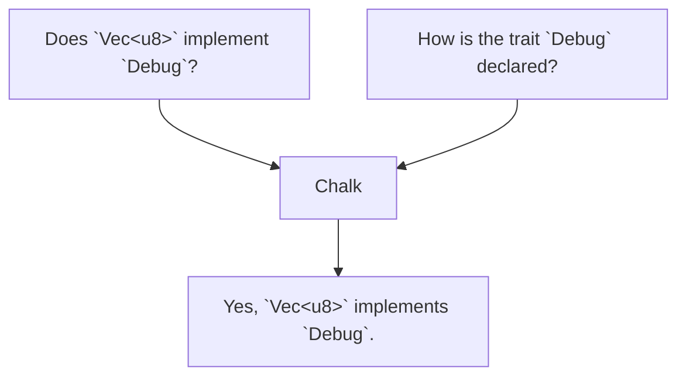
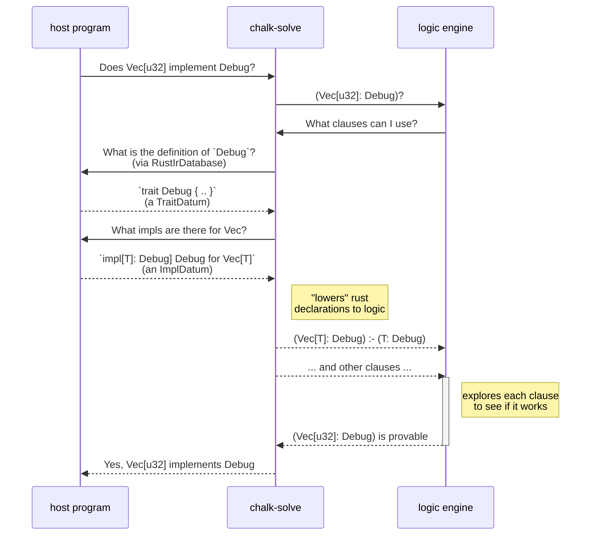

# What is Chalk?

> Chalk is under heavy development, so if any of these links are broken or if
> any of the information is inconsistent with the code or outdated, please
> [open an issue][issues] so we can fix it. If you are able to fix the
> issue yourself, we would love your contribution!

Chalk is a library that implements the Rust trait system. The implementation is
meant to be practical and usable, but also high-level enough to map easily to a
full specification. It is also meant to be an independent library that can be
integrated both into the main rustc compiler and also other programs and
contexts.

[issues]: https://github.com/rust-lang/chalk/issues

## High-level view of how chalk works

Chalk is designed to answer queries about traits, such as "Does the type `Vec<u8>` implement `Debug`"? (Yes!). It can in some cases give inference feedback, such as "Is there a unique type `T` such that `str: AsRef<T>`"? In that case, the answer might be "Yes, `T = str`."

To do this, it takes as input key information about a Rust program, such as:

* For a given trait, what are its type parameters, where clauses, and associated items
* For a given impl, what are the types that appear in the impl header
* For a given struct, what are the types of its fields

## Chalk works by converting Rust goals into logical inference rules

Internally, Chalk works by converting the Rust-specific information, like traits
and impls, into *logical predicates*. This process is called "lowering", and you
can learn more about it in the [*Lowering to Logic*][lowering-to-logic] and
[*Lowering Rules*][lowering-rules]) sections.

[lowering-rules]: ./clauses/lowering_rules.html
[lowering-to-logic]: ./clauses.html

After lowering to logical predicates, Chalk then deploys a *logical solver* to
find the answer to the original query; this solver is similar to a Prolog
engine, though different in its particulars.

The following sequence diagram helps to illustrate the flow of information that occurs
when Chalk is solving a particular goal. It involves three participants:

* The **host program**, which might be rustc, rust-analyzer, or chalk's internal
  testing harness. The host program, importantly, only thinks about things in
  **Rust terms**, like traits and impls.
* The **chalk-solve** crate, which converts between Rust terms and logical clauses.
* The **logic engine** layer, which knows how to solve logical clauses but knows nothing specific to Rust.

## Chalk repl

In addition to being embedded into host programs, chalk also has its own testing
harness along with an associated REPL. This allows us to write unit tests that
use a "Rust-like" syntax. The REPL then makes it easy to experiment and get a
better feel for how chalk works. See the [walkthrough] for more details.

[walkthrough]: what_is_chalk/walkthrough.html

